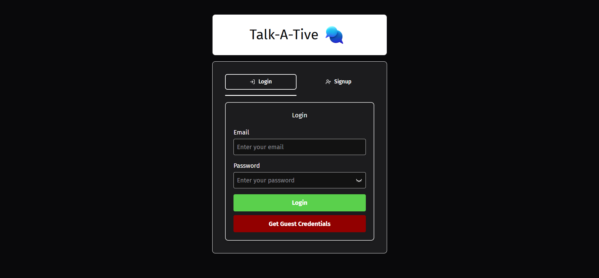
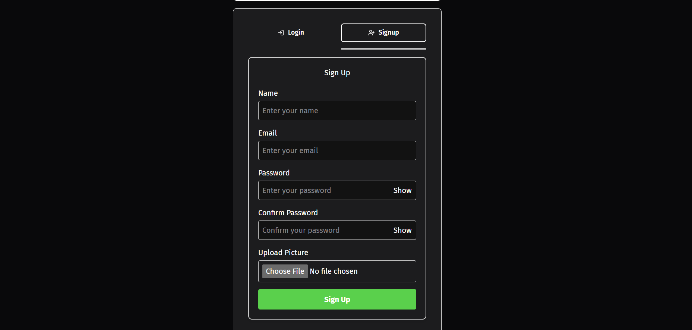
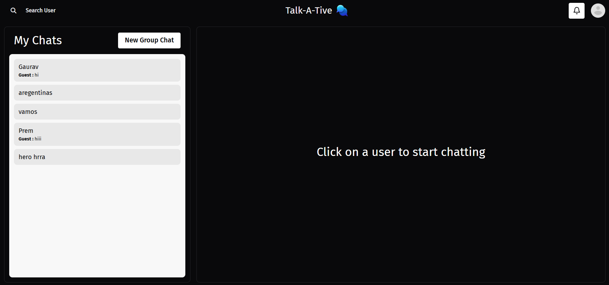
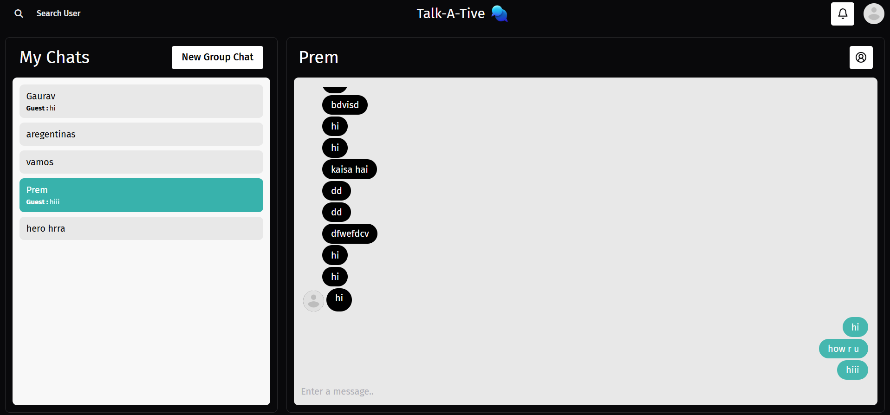
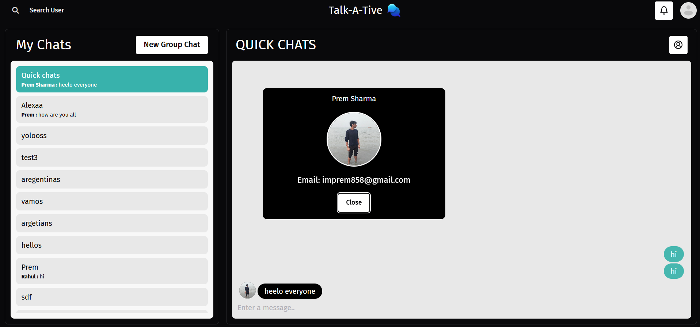
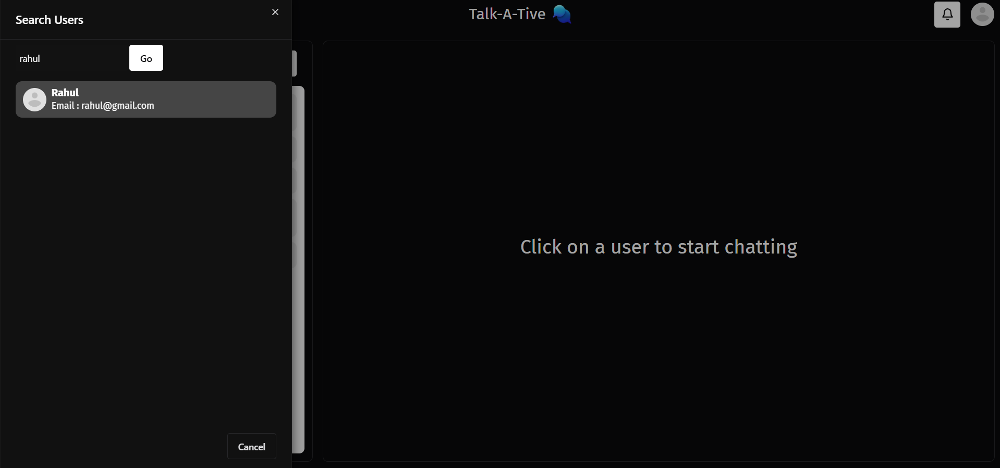
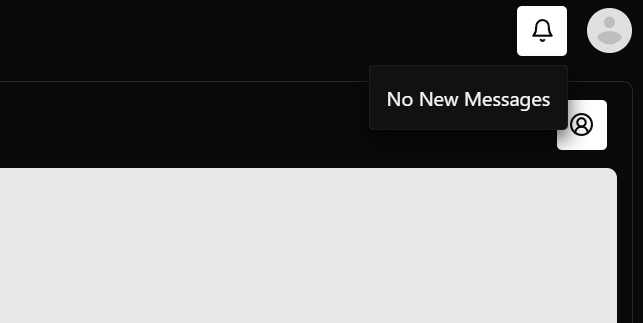
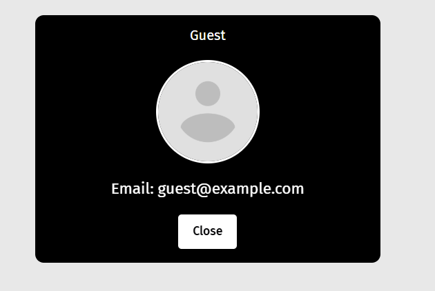

# Talk-A-Tive


Talk-A-Tive is a feature-rich **MERN** (MongoDB, Express.js, React.js, Node.js) chat application designed to facilitate seamless communication between users. Whether you're looking to engage in one-on-one conversations or participate in vibrant group chats, Talk-A-Tive has you covered. With robust authentication, real-time messaging, user search capabilities, and comprehensive profile management, this application offers a complete chat experience.

## Table of Contents

- [Features](#features)
- [Screenshots](#screenshots)
- [Demo](#demo)
- [Installation](#installation)
- [Usage](#usage)
- [Technologies Used](#technologies-used)
- [Contributing](#contributing)
- [License](#license)
- [Contact](#contact)

## Features

- **User Authentication**
  - **Login Screen:** Secure user login with validation.
  - **Signup Screen:** Easy user registration with necessary details.

- **Chat Functionality**
  - **Chat Page:** Real-time messaging interface.
  - **Single Chat:** One-on-one conversations with other users.
  - **Group Chat:** Create and participate in group conversations.
  - **User Search:** Find and connect with other users effortlessly.
  - **Group Creation & Updation:** Create new groups and manage existing ones.

- **Notifications**
  - **Real-Time Alerts:** Get notified about new messages and activities.
  
- **Profile Management**
  - **Profile Section:** View and update your personal information and settings.

- **Responsive Design**
  - Optimized for various screen sizes and devices.

## Screenshots

### 1. Login Screen



### 2. Signup Screen



### 3. Chat Page



### 4. Single Chat



### 5. Group Chat



### 6. User Search



### 7. Group Creation & Updation


### 8. Notifications



### 9. Profile Section



*Note: Replace the placeholder paths (`./screenshots/...`) with the actual paths to your screenshot images in the repository.*

## Demo

Access the live demo of Talk-A-Tive [here](https://talk-a-tive-amy0.onrender.com).

*Replace `https://your-live-demo-link.com` with the actual URL where your application is deployed.*

## Installation

Follow these steps to set up Talk-A-Tive locally on your machine.

### Prerequisites

- **Node.js** (v14 or later)
- **npm** (v6 or later)
- **MongoDB** (Local installation or access to a MongoDB Atlas cluster)

### Clone the Repository

```bash
git clone https://github.com/yourusername/talk-a-tive.git
cd talk-a-tive
```

### Backend Setup

1. **Navigate to the Backend Directory:**

    ```bash
    cd backend
    ```

2. **Install Dependencies:**

    ```bash
    npm install
    ```

3. **Configure Environment Variables:**

    - Create a `.env` file in the `backend` directory.
    - Add the following variables:

      ```env
      PORT=5000
      MONGO_URI=your_mongodb_connection_string
      JWT_SECRET=your_jwt_secret
      ```

    *Replace `your_mongodb_connection_string` and `your_jwt_secret` with your actual MongoDB URI and JWT secret key.*

4. **Start the Backend Server:**

    ```bash
    npm start
    ```

### Frontend Setup

1. **Navigate to the Frontend Directory:**

    ```bash
    cd ../frontend
    ```

2. **Install Dependencies:**

    ```bash
    npm install
    ```

3. **Configure Environment Variables:**

    - Create a `.env` file in the `frontend` directory.
    - Add the following variables:

      ```env
      VITE_API_URL=http://localhost:5000/api
      ```

    *Adjust the `VITE_API_URL` if your backend is hosted elsewhere.*

4. **Start the Frontend Server:**

    ```bash
    npm run dev
    ```

5. **Access the Application:**

    Open your browser and navigate to `http://localhost:5173` (or the port specified in the terminal) to view Talk-A-Tive.

## Usage

1. **Register a New Account:**
   - Navigate to the signup page.
   - Fill in your details and create an account.

2. **Login:**
   - Enter your credentials on the login screen to access your dashboard.

3. **Start Chatting:**
   - Use the chat page to engage in conversations.
   - Create groups, search for users, and manage your chats seamlessly.

4. **Manage Profile:**
   - Access your profile section to update personal information and settings.

## Technologies Used

- **Frontend:**
  - [React.js](https://reactjs.org/)
  - [Chakra UI](https://chakra-ui.com/) for UI components
  - [Vite](https://vitejs.dev/) as the build tool
  - [React Router](https://reactrouter.com/) for routing

- **Backend:**
  - [Node.js](https://nodejs.org/)
  - [Express.js](https://expressjs.com/) for server framework
  - [MongoDB](https://www.mongodb.com/) with [Mongoose](https://mongoosejs.com/) for database
  - [JWT](https://jwt.io/) for authentication
  - [bcrypt.js](https://github.com/dcodeIO/bcrypt.js) for password hashing

- **Others:**
  - [Axios](https://axios-http.com/) for HTTP requests
  - [Nodemon](https://nodemon.io/) for development
  - [React Icons](https://react-icons.github.io/react-icons/) for iconography

## Contributing

Contributions are welcome! Follow these steps to contribute to Talk-A-Tive:

1. **Fork the Repository**

    Click the "Fork" button at the top-right corner of the repository page.

2. **Clone Your Fork**

    ```bash
    git clone https://github.com/yourusername/talk-a-tive.git
    cd talk-a-tive
    ```

3. **Create a New Branch**

    ```bash
    git checkout -b feature/YourFeatureName
    ```

4. **Make Your Changes**

    Implement your feature or bug fix.

5. **Commit Your Changes**

    ```bash
    git commit -m "Add your message here"
    ```

6. **Push to Your Fork**

    ```bash
    git push origin feature/YourFeatureName
    ```

7. **Open a Pull Request**

    Navigate to the original repository and click on "Compare & pull request".

## License

This project is licensed under the [MIT License](LICENSE).

## Contact

For any inquiries or feedback, please contact:

- **Your Name**
- **Email:** [imprem858@gmail.com](mailto:imprem858@gmail.com)
- **LinkedIn:** [linkedin.com/in/prem858](https://www.linkedin.com/in/prem858/)
- **GitHub:** [github.com/Premiiitn](https://github.com/Premiiitn)

---

*Feel free to customize this README further to better fit your project's specifics, such as adding more screenshots, adjusting installation steps, or including additional sections like FAQs or acknowledgments.*
